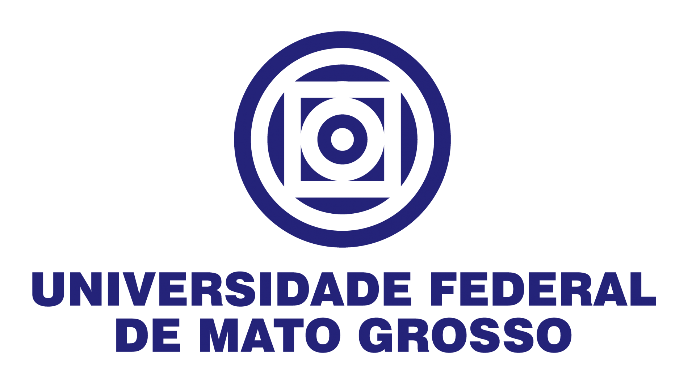

<div align="center">
    
    

    Materiais
</div>

Essa pasta contém documentos e links úteis para auxiliar no aprendizado de uso da biblioteca **PVLIB**.

<br><br>

# 🗂️ Links úteis

- [Documentação da Biblioteca](https://pvlib-python.readthedocs.io/en/stable/reference/index.html) 
- [Playlist no Youtube sobre o pvlib](https://www.youtube.com/watch?v=zKzhMQaNjDI&list=PLK7k_QaEmaHsPk_mwzneTE2VTNCpYBiky&index=1)
- [Base de dados de módulos e inversores](https://github.com/NREL/SAM/tree/develop/deploy/libraries)
- [Consulta de Fusos Horários](https://en.wikipedia.org/wiki/List_of_tz_database_time_zones)
- [TMY Generator](https://re.jrc.ec.europa.eu/pvg_tools/en/)

<br><br>

# 💾 Download
Baixe os exemplos deste repositório em formato `.zip` [através deste link](https://github.com/CristhianGRO/IntroducaoAoPVLIB/archive/refs/heads/main.zip)

<br><br>

# ✉️ Contato

Dúvidas ou sugestões? Entre em contato conosco: 

- **E-mail:** cristhiangro@gmail.com

<br><br>

# 💬 Cite este repositório

```bibtex
@article{IntroducaoAoPVLIB,
    title    = {Introdução ao pvlib},
    year     = {2023},
    url      = {https://github.com/CristhianGRO/IntroducaoAoPVLIB},
    author   = {Cristhian Gabriel da Rosa de Oliveira},
}
```
